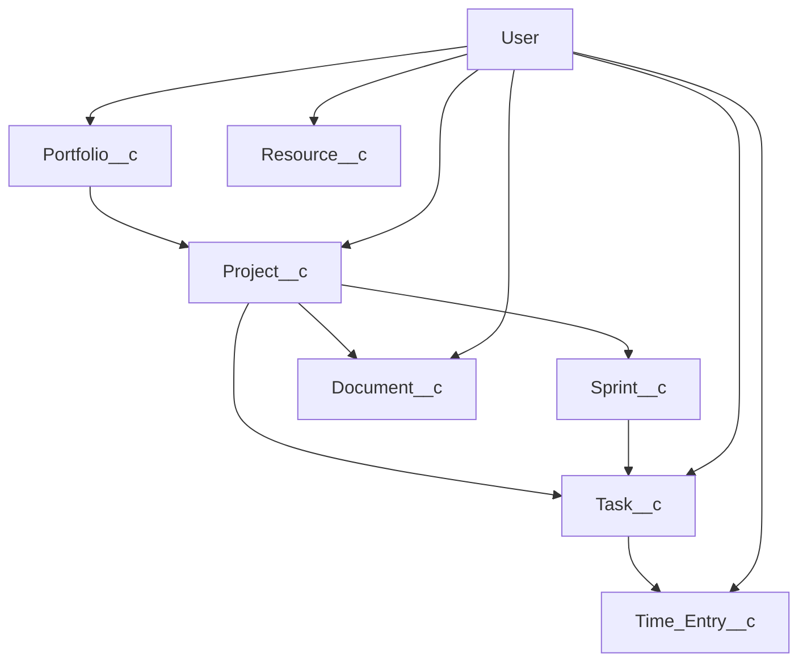

# Salesforce Project Hub Metadata Generator

🚀 **Node.js script to generate complete Salesforce Project Hub metadata files**

This script generates all necessary SFDX metadata files for a comprehensive project management platform on Salesforce, including 7 custom objects with 64+ fields, relationships, and proper SFDX structure.

## 🎯 What It Generates

### Custom Objects Created:

1. **Portfolio\_\_c** - Groups related projects together
2. **Project\_\_c** - Core project entity (Master-Detail to Portfolio)
3. **Sprint\_\_c** - Agile sprint management (Lookup to Project)
4. **Task\_\_c** - Individual work items (Master-Detail to Project)
5. **Time_Entry\_\_c** - Time tracking (Master-Detail to Task)
6. **Resource\_\_c** - Extended user information (Unique Lookup to User)
7. **Document\_\_c** - Project documentation (Lookup to Project)

### Key Features:

- ✅ Auto-number naming (PORTFOLIO-0001, PROJ-0001, etc.)
- ✅ Master-Detail and Lookup relationships
- ✅ Formula fields (Total_Cost = Hours × Hourly_Rate)
- ✅ Default values (TODAY(), $User.Id, custom defaults)
- ✅ Picklist and Multi-select picklist fields
- ✅ All field types: Text, LongTextArea, Date, Currency, Number, Checkbox
- ✅ Proper SFDX structure ready for deployment
- ✅ API Version 59.0 with full feature enablement

## 🛠️ Usage

### Quick Start

```bash
# Generate all metadata files
node generate-metadata.js

# Or using npm script
npm run generate:metadata
```

### Available Scripts

```bash
# Generate metadata files
npm run generate:metadata

# Clean existing metadata
npm run clean:metadata

# Validate metadata before deployment
npm run validate:objects

# Deploy to Salesforce org
npm run deploy:objects
```

## 📁 Generated Structure

The script creates the following SFDX structure:

```
force-app/main/default/objects/
├── Portfolio__c/
│   ├── Portfolio__c.object-meta.xml
│   └── fields/
│       ├── Portfolio_Name__c.field-meta.xml
│       ├── Description__c.field-meta.xml
│       ├── Status__c.field-meta.xml
│       ├── Budget__c.field-meta.xml
│       ├── Start_Date__c.field-meta.xml
│       ├── End_Date__c.field-meta.xml
│       └── Owner__c.field-meta.xml
├── Project__c/
│   ├── Project__c.object-meta.xml
│   └── fields/ (12 field files)
├── Sprint__c/
│   ├── Sprint__c.object-meta.xml
│   └── fields/ (8 field files)
├── Task__c/
│   ├── Task__c.object-meta.xml
│   └── fields/ (17 field files)
├── Time_Entry__c/
│   ├── Time_Entry__c.object-meta.xml
│   └── fields/ (8 field files)
├── Resource__c/
│   ├── Resource__c.object-meta.xml
│   └── fields/ (7 field files)
└── Document__c/
    ├── Document__c.object-meta.xml
    └── fields/ (8 field files)
```

## 🔗 Object Relationships



- Portfolio → Project (Master-Detail)
- Project → Task (Master-Detail)
- Project → Sprint (Lookup)
- Task → Sprint (Lookup)
- Task → Time_Entry (Master-Detail)
- User → Resource (Unique Lookup)
- Various User lookups for ownership

## ⚙️ Configuration

The script is fully configurable through the `getObjectDefinitions()` method. You can:

- Add/remove objects
- Modify field definitions
- Change relationships
- Update picklist values
- Customize auto-number formats
- Modify default values

### Example Field Definition:

```javascript
{
    apiName: 'Status__c',
    label: 'Status',
    type: 'Picklist',
    valueSet: {
        values: ['Planning', 'Active', 'On Hold', 'Completed']
    }
}
```

## 🚀 Deployment

1. **Generate metadata:**

   ```bash
   npm run generate:metadata
   ```

2. **Validate before deployment:**

   ```bash
   npm run validate:objects
   ```

3. **Deploy to your org:**

   ```bash
   npm run deploy:objects
   ```

   Or use the Salesforce CLI directly:

   ```bash
   sf project deploy start --source-dir force-app/main/default/objects
   ```

## 📋 Field Types Supported

| Type                | Example                  | Features                  |
| ------------------- | ------------------------ | ------------------------- |
| Text                | `Task_Name__c`           | Length, Required          |
| LongTextArea        | `Description__c`         | Length, Visible Lines     |
| Date                | `Start_Date__c`          | Default values (TODAY())  |
| Currency            | `Budget__c`              | Precision, Scale          |
| Number              | `Story_Points__c`        | Precision, Scale          |
| Percent             | `Progress_Percentage__c` | Precision, Scale          |
| Checkbox            | `Billable__c`            | Default values            |
| Picklist            | `Status__c`              | Value sets                |
| MultiselectPicklist | `Skills__c`              | Value sets, Visible Lines |
| Lookup              | `Owner__c`               | Relationships             |
| MasterDetail        | `Portfolio__c`           | Relationships, Cascade    |
| Formula             | `Total_Cost__c`          | Currency formula          |
| AutoNumber          | Name field               | Display format            |

## 🎛️ Object Configuration

All objects are configured with:

- ✅ Activities enabled
- ✅ Reports enabled
- ✅ Search enabled
- ✅ History tracking enabled
- ✅ Feed tracking enabled
- ✅ Sharing enabled
- ✅ Private sharing model
- ✅ Deployed status
- ✅ Public visibility

## 📚 Requirements

- Node.js 14.0.0 or higher
- Salesforce CLI (for deployment)
- SFDX project structure

## 🔧 Development

### Extending the Generator

To add a new object:

1. Add object definition to `getObjectDefinitions()` array
2. Define fields with proper types and relationships
3. Run the generator to create files

### Custom Field Types

The generator supports all Salesforce field types through the `generateFieldXml()` method. Add new field type support by extending this method.

## 📄 License

MIT License - feel free to use this generator for your Salesforce projects!

---

**Generated Files:** 71 total (7 objects + 64 fields)  
**Ready for Production:** ✅  
**SFDX Compatible:** ✅  
**API Version:** 59.0
